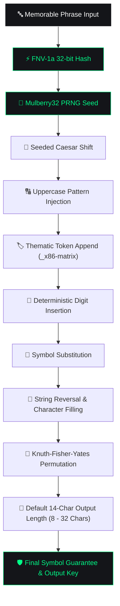

# 🛡️ PassEvolver v1.2

<div align="center">

```
  ____                 _____            _                 
 |  _ \ __ _ ___ ___  | ____|_   _____ | |_   _____ _ __  
 | |_) / _` / __/ __| |  _| \ \ / / _ \| \ \ / / _ \ '__| 
 |  __/ (_| \__ \__ \ | |___ \ V / (_) | |\ V /  __/ |    
 |_|   \__,_|___/___/ |_____| \_/ \___/|_| \_/ \___|_|    
```

### Deterministic Password Engine & Manifest V3 WebExtension

🌐 **Live Demo Website**: **[https://rishikesh-001.github.io/Pass-Evolver/](https://rishikesh-001.github.io/Pass-Evolver/)**

[](https://rishikesh-001.github.io/Pass-Evolver/)
[](https://rishikesh-001.github.io/Pass-Evolver/)
[](https://github.com/Rishikesh-001/Pass-Evolver)
[](https://rishikesh-001.github.io/Pass-Evolver/)

---

</div>

> [!IMPORTANT]
> **PassEvolver** transforms memorable phrases into repeatable, high-entropy cryptographic keys without storing master passwords in cloud vaults. Everything runs 100% client-side in local browser memory with automated background cache purging.
>
> 🚀 **Access the Live Web Application**: **[https://rishikesh-001.github.io/Pass-Evolver/](https://rishikesh-001.github.io/Pass-Evolver/)**

---

## 📐 12-Stage Deterministic Evolution Pipeline

PassEvolver uses a zero-dependency, 12-stage mathematical transformation pipeline to produce repeatable passwords:



---

## ✨ Key Features & Recent Security Updates

| Feature | Description | Web Dashboard | Extension |
| :--- | :--- | :---: | :---: |
| **Default 14-Char Output** | Default output length tuned to 14 characters (range 8–32) | ✅ | ✅ |
| **Syntax Color Highlighting** | Real-time color classification (`0-9` Green, Symbols Cyan, Uppercase White, Lowercase Grey) | ✅ | ✅ |
| **Mask / Reveal Eye Toggle (`👁️`)** | Quick eye button to switch output display between plaintext & obfuscated dots (`••••`) | ✅ | ✅ |
| **30-Second Clipboard Auto-Clear** | Interactive countdown toast that purges copied passwords from system memory after 30s | ✅ | ⚡ |
| **Auto Refresh Cache Purge** | Automatically wipes browser `CacheStorage` & `sessionStorage` whenever page is reloaded | ✅ | ✅ |
| **10x Determinism Verifier** | Benchmark suite testing parallel execution consistency (< 0.08ms latency) | ✅ | ⚡ |
| **Auto Domain Salt Detection** | Automatically detects active website domain (e.g. `github.com`) as service salt | ⚡ | ✅ |
| **1-Click Password Auto-Fill** | Injects output keys directly into password fields on active web pages | ⚡ | ✅ |
| **Pure White Glowing Cursor** | Compact 120px radial white light trail following mouse movement | ✅ | ⚡ |
| **Seamless Preloader Screen** | High-tech initialization sequence with neon green progress track | ✅ | ⚡ |

---

## 🎨 UI Design System

PassEvolver is styled inspired by modern cybersecurity tools (Linear, Raycast, 1Password, Vercel):

- **Matte Base**: `#0C0D10` dark backdrop with ambient glowing vignetting.
- **Glass Cards**: `#141519` backdrop blur (`blur(16px)`) with subtle white borders.
- **Neon Accents**: Electric `#00FF87` (Green) and `#00E5FF` (Cyan) syntax highlighting.
- **Interactive Micro-Animations**: Card hover elevations (`translateY(-4px)`), ambient green aura shadows, icon rotations (`scale(1.25)`), and compact white cursor trails (`120px`).

---

## 🧩 Manifest V3 Browser Extension Installation

PassEvolver includes a native WebExtension package for **Chrome, Edge, Brave, Opera, and Firefox**.

```
Pass-Evolver/
├── extension/
│   ├── manifest.json       <-- WebExtension Manifest V3
│   ├── popup.html          <-- Compact 380px x 560px Popup UI
│   ├── popup.css           <-- Extension Stylesheet
│   ├── popup.js            <-- Domain Auto-Salt & 1-Click Auto-Fill
│   ├── engine.js           <-- 100% Offline Evolution Engine
│   └── icons/              <-- Extension Icons
```

### 3-Step Setup:
1. Open `chrome://extensions` (or `edge://extensions`) in your browser.
2. Enable **Developer mode** in the top right corner.
3. Click **Load unpacked** and select the [`extension/`](extension/) directory from this repository.

> [!TIP]
> Opening the extension popup on any website (e.g., `github.com`) automatically sets the **Service Salt** to the active website domain!

---

## 💻 Local Web Application Setup

### Prerequisites
- Node.js installed on your system.

### Running Locally
1. Clone the repository:
   ```bash
   git clone https://github.com/Rishikesh-001/Pass-Evolver.git
   cd Pass-Evolver
   ```

2. Start the local server:
   ```bash
   npx -y serve . -p 8080
   ```

3. Open your browser to **`http://localhost:8080`** or visit **[https://rishikesh-001.github.io/Pass-Evolver/](https://rishikesh-001.github.io/Pass-Evolver/)**.

---

## ⌨️ Keyboard Shortcuts

| Shortcut | Action |
| :--- | :--- |
| `Ctrl + Shift + C` | Copy generated password to clipboard (starts 30s auto-clear timer) |
| `Esc` | Clear phrase input / close active modals |

---

## 📜 Security Philosophy

> [!NOTE]
> PassEvolver does not replace KDFs for vault encryption but creates repeatable, deterministic aliases for secondary assets. Zero network requests are performed by the application, and all browser caches & session storage are automatically purged upon page refresh.

---

## 📄 License
Released under the MIT License. © 2024 PASSEVOLVER SECURE.